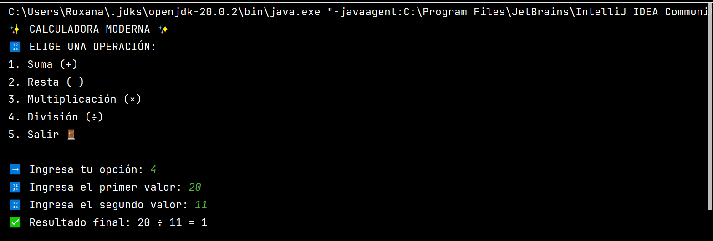

# 🧮 Calculadora Moderna en Java

  
  

Una calculadora interactiva con interfaz amigable y operaciones básicas, desarrollada en Java.

## ✨ Características

- ✅ Operaciones básicas: suma, resta, multiplicación y división
- ✅ Menú interactivo con emojis
- ✅ Validación de entradas
- ✅ Manejo de errores (división por cero, valores no numéricos)
- ✅ Bucle continuo hasta que el usuario elija salir

## 🛠️ Cómo ejecutarlo

1. Clona el repositorio:
   ```bash
   git clone https://github.com/tu-usuario/calculadora-java.git

ELIGE UNA OPERACIÓN:
1. Suma (+)
2. Resta (-)
3. Multiplicación (×)
4. División (÷)
5. Salir 🚪

➡️ Ingresa tu opción: 1
🔢 Ingresa el primer valor: 30
🔢 Ingresa el segundo valor: 40.5
✅ Resultado final: 30.0 + 40.5 = 70.5

ELIGE UNA OPERACIÓN:
1. Suma (+)
2. Resta (-)
3. Multiplicación (×)
4. División (÷)
5. Salir 🚪

➡️ Ingresa tu opción: 4
🔢 Ingresa el primer valor: 20
🔢 Ingresa el segundo valor: 11
✅ Resultado final: 20 ÷ 11 = 1.818


### 📌 Para incluir las imágenes en GitHub:
1. Sube las imágenes (`cal1.png` y `calculator.png`) a una carpeta `images/` en tu repositorio.
2. Usa la sintaxis Markdown ajustando las rutas:
   ```markdown
   
   